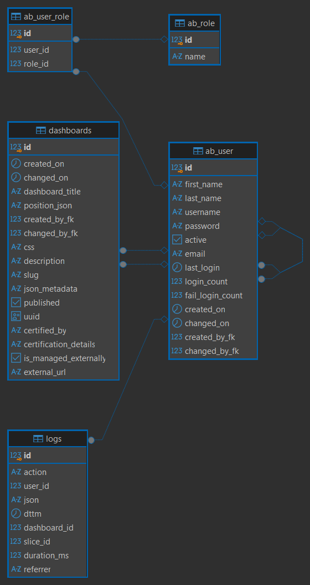
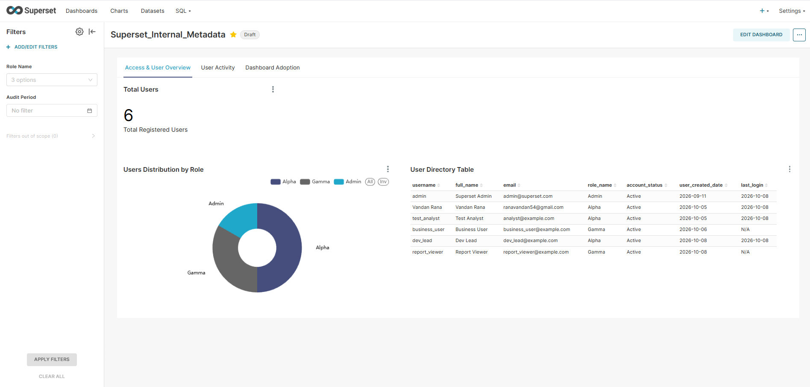
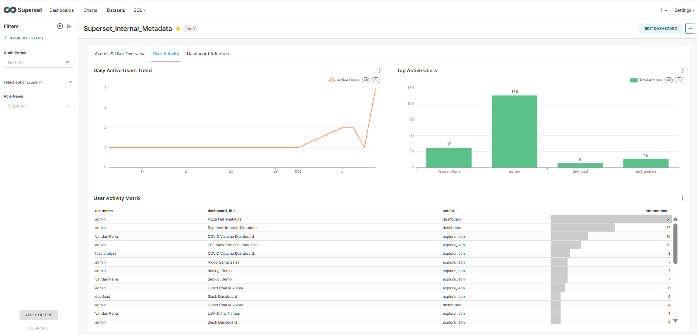
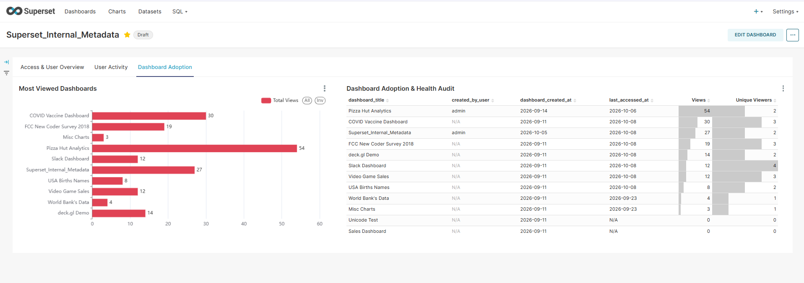

# Apache Superset Internal Metadata Audit & Governance Dashboard

## 📌 Project Overview
In enterprise Business Intelligence (BI) environments, security auditing, Role-Based Access Control (RBAC), and asset adoption tracking are critical for platform health and compliance. This project directly leverages Apache Superset's underlying **PostgreSQL Application Metadata Store** to engineer an end-to-end, real-time Audit & Governance Dashboard.

---

## 🏗️ Architecture & Tech Stack
* **BI Platform:** Apache Superset
* **Underlying Metadata Store:** PostgreSQL (Application Database)
* **Database Management Client:** DBeaver
* **Infrastructure:** Docker Containers
* **Query Language:** SQL (Complex CTEs, Window Functions, Sequences, Foreign Key Mappings)

---

## 🗄️ Relational Metadata Schema (ERD)
 
 
The dashboard monitors and audits five core application tables within the PostgreSQL metadata store:
1. `ab_user`: User identity attributes, active status, and creation timestamps.
2. `ab_role`: Security roles configured across the platform (`Admin`, `Alpha`, `Gamma`).
3. `ab_user_role`: Many-to-many junction table mapping security roles to user accounts.
4. `dashboards`: Registry of analytical dashboards, published status, and owners.
5. `logs`: Platform telemetry recording user actions, path invocations, and dashboard access events.

---

## 📊 Dashboard Architecture & Modules

### 1. Access & User Overview (Tab 1)

* **Total Users (KPI Metric):** Real-time tally of registered user accounts across the system.
* **Role Distribution (Donut Chart):** Proportional distribution of platform users across RBAC levels (`Admin`, `Alpha`, `Gamma`).
* **User Directory (Interactive Table):** Searchable table detailing user full names, emails, assigned roles, and account activation states.

---

### 2. User Activity & Engagement (Tab 2)

* **Daily Active Users Trend (Line Chart):** Longitudinal daily active user (DAU) trends based on event logs.
* **Top Active Users (Bar Chart):** Action volume rankings highlighting the most active users across the platform.
* **User Activity Matrix (Detailed Table):** Granular interaction audit tracking specific user actions against targeted dashboard assets.

---

### 3. Dashboard Adoption & Governance (Tab 3)

* **Most Viewed Dashboards (Horizontal Bar Chart):** Asset consumption leaderboard ranking dashboards by total view count.
* **Dashboard Adoption & Health Audit (Data Bar Table):**
  * Total cumulative views
  * Count of distinct user visits (Unique Viewers)
  * Asset creation date and last access timestamp
  * Identification of dormant, orphaned, or stale analytical assets for cleanup and governance.

## ⚙️ Key Technical Challenges Resolved
* **PostgreSQL Sequence Synchronization:** Resolved primary key collision errors (`duplicate key value violates unique constraint Key (id)=...`) resulting from manual SQL seeding by resynchronizing `ab_user_id_seq` and `ab_user_role_id_seq` via dynamic `setval(..., (SELECT MAX(id) FROM ...))` scripts.
* **RBAC & Permission Boundaries:** Audited granular data access boundaries between administrative access (`Admin`), authoring permissions (`Alpha`), and consumer restrictions (`Gamma`).

---

## 🚀 How to Replicate
1. Initialize the Apache Superset container cluster.
2. Establish a connection to the PostgreSQL metadata store using DBeaver or psql.
3. Execute the analytical queries located in the `sql/` folder to build the virtual datasets.
4. Create the visualizations as configured and organize them into the 3-tab governance dashboard.